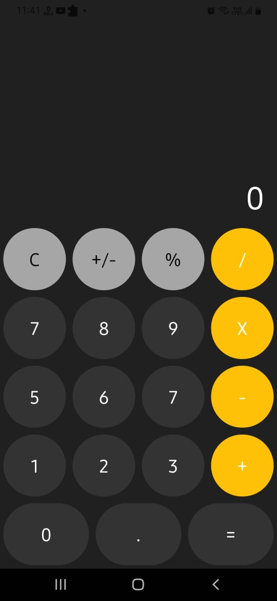

<div align="center" id="top"> 
  

&#xa0;

  <!-- <a href="https://calculatorapp.netlify.app">Demo</a> -->
</div>

<h1 align="center">React Native - Calculator App</h1>

<p align="center">
  

  

  
</p>


<p align="center">
  
</p>

<br>

## :dart: About

Build a calculator app using React Native.

## :sparkles: Features

:heavy_check_mark: common features in calculator app like (+, -, \*, /));

## :rocket: Technologies

The following tools were used in this project:

- [Expo](https://expo.io/)
- [React Native](https://reactnative.dev/)
- [Node.js](https://nodejs.org/)

## :white_check_mark: Requirements

Before starting :checkered_flag:, you need to have [Git](https://git-scm.com), [Node](https://nodejs.org/en/), [Expo](https://expo.io/) and [React Native](https://reactnative.dev/) installed.

## :checkered_flag: Starting

```bash
# Clone this project
$ git clone https://github.com/bangadam/calculator-app

# Access
$ cd calculator-app

# Install dependencies
$ yarn install

# Run the project
$ yarn ios // for iOS
$ yarn android // for Android

# then open the app in Expo
```

